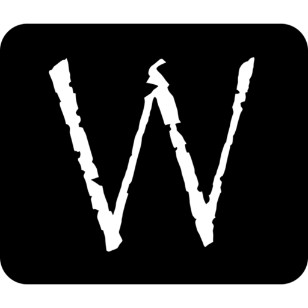

<!-- PROJECT LOGO -->
 

  
  
  <h3 align="center">Wintex</h3>

  

    MERN eCommerce application
     
    <a href="#table-of-contents"><strong>Explore the docs ↓</strong></a>
     
     
    <a href="https://wintex.herokuapp.com" target="_blank">View Demo</a>
    ·
    <a href="https://github.com/olayis/wintex/issues">Report Bug</a>
    ·
    <a href="https://github.com/olayis/wintex/issues">Request Feature</a>
  

<!-- TABLE OF CONTENTS -->

## Table of Contents

- [About the Project](#about-the-project)
  - [Built With](#built-with)
- [License](#license)
- [Contact](#contact)

<!-- ABOUT THE PROJECT -->

## About The Project

### Built With

- React.js
- MaterialUI
- Node
- MongoDB
- Express
- Redux

<!-- LICENSE -->

## License

Distributed under the MIT License. See `LICENSE` for more information.

<!-- CONTACT -->

## Contact

Olayinka Olusegun

- olayinkasegunsolo@gmail.com
- LinkedIn - <https://linkedin.com/in/olusegun-olayinka>
- Twitter - [@olusegun_os](https://twitter.com/olusegun_os)

Project Link: <https://wintex.herokuapp.com>
